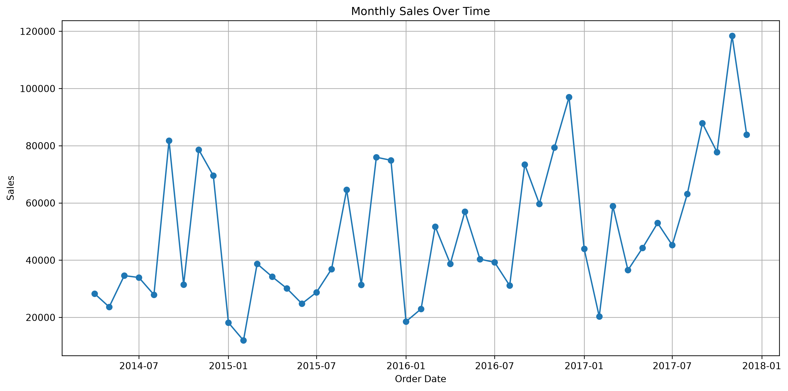
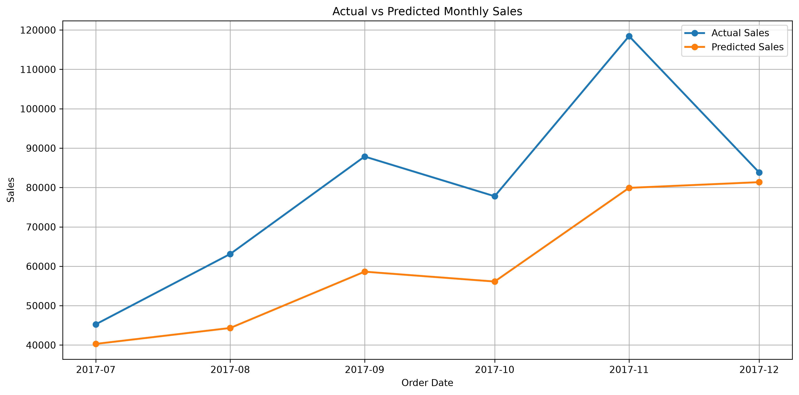

# 📈 Sales Forecasting using Random Forest

## Project Overview

This project focuses on forecasting monthly sales using the **Sample Superstore** dataset and a **Random Forest Regression** model.

The workflow includes data exploration, feature engineering, model training, evaluation, and visualization of forecasting results. The objective is to demonstrate a complete machine learning pipeline for a regression problem.

---

## Dataset

**Sample Superstore Dataset**

- 9,994 sales transactions
- Time period: 2014–2017
- 21 original features
- Monthly sales aggregated for forecasting

---

## Technologies

- Python
- Pandas
- NumPy
- Matplotlib
- Scikit-learn
- Joblib
- Jupyter Notebook

---

## Machine Learning Workflow

- Data Loading
- Data Cleaning
- Exploratory Data Analysis (EDA)
- Monthly Sales Aggregation
- Feature Engineering
- Train/Test Split
- Random Forest Regression
- Model Evaluation
- Forecast Visualization
- Model Serialization

---

## Feature Engineering

The following time-based features were created:

- Year
- Month
- Previous Month Sales (Lag 1)
- Previous 2 Months Sales (Lag 2)
- Previous 3 Months Sales (Lag 3)
- 3-Month Rolling Average

---

## Model Performance

The model was evaluated on the final six months of the dataset.

| Metric | Value |
|---------|-------|
| MAE | **19,280.33** |
| RMSE | **23,070.12** |

Although the model does not perfectly predict future sales, it successfully captures the overall sales trend and demonstrates the use of machine learning for business forecasting.

---

## Project Structure

```
TASK_01_Sales_Forecasting/
│
├── data/
│   └── Sample - Superstore.csv
│
├── images/
│   ├── monthly_sales_over_time.png
│   └── actual_vs_predicted_sales.png
│
├── models/
│   └── random_forest_sales_model.pkl
│
├── sales_forecasting.ipynb
├── requirements.txt
└── README.md
```

---

## Visualizations

### Monthly Sales Trend



### Actual vs Predicted Monthly Sales



---

## Future Improvements

- Collect more historical sales data
- Hyperparameter tuning
- Time-series cross-validation
- Feature selection
- Testing XGBoost
- Testing Prophet
- Testing SARIMA
- Testing LSTM networks

---

## Author

**Agata Gabara**

GitHub: https://github.com/ag48665

Machine Learning Internship Portfolio – Future Interns
